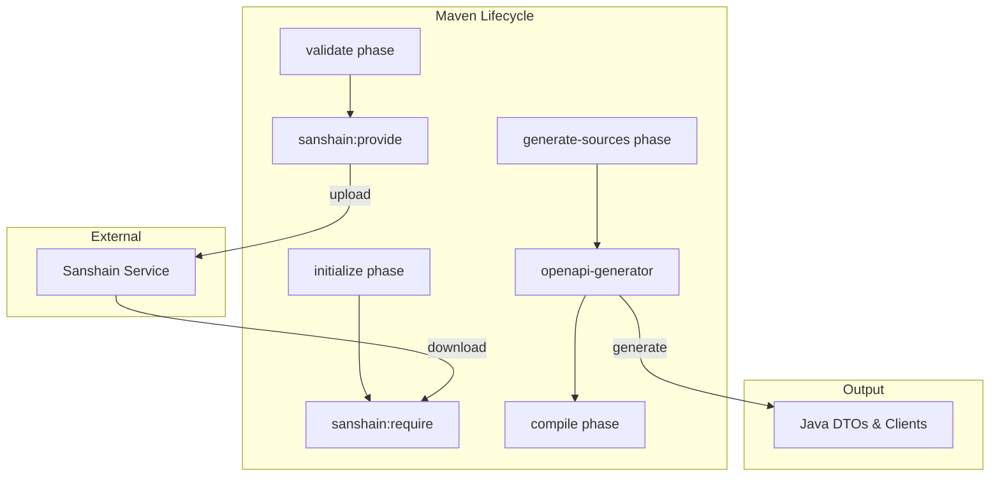

# Maven Lifecycle Integration

The Sanshain Maven Plugin is designed to seamlessly integrate into the standard Maven build lifecycle. It ensures that API contracts are validated and downloaded before code generation and compilation occur.

## Execution Flow

The following diagram shows how the Sanshain goals interact with the Maven lifecycle and external tools:

## Goals & Phases

### `sanshain:provide`
- **Default Phase**: `validate`
- **Note**: While a default phase is defined, we recommend explicitly specifying `<phase>validate</phase>` in your `pom.xml` for maximum compatibility across different Maven versions.
- **Purpose**: Uploads the service's API specifications to the Sanshain service under the version declared in the spec file and the stability declared for this build.
- **Why `validate`?**: It ensures that the contract is registered and validated at the very beginning of the build. If the provide is rejected by the version rules (e.g. a GA version whose content changed without a version bump), the build fails as early as possible — with the server's `proposed_version` in the error.

### `sanshain:require`
- **Default Phase**: `initialize`
- **Note**: While a default phase is defined, we recommend explicitly specifying `<phase>initialize</phase>` in your `pom.xml` for maximum compatibility across different Maven versions.
- **Purpose**: Downloads the endpoint snippets required by the service at their exact pinned versions.
- **Why `initialize`?**: It ensures that the required snippets are downloaded and ready before the `generate-sources` phase begins. This provides a clean separation between downloading dependencies and generating code from them.

## Key Mechanisms

### Automatic Bundling
When a service requires **2 or more endpoints** from the same provider, the plugin automatically bundles them into a single `_bundle.yaml` file. This prevents the generation of duplicate DTO classes that would occur if each endpoint were processed individually.

### Immediate Resolution
The `require` goal resolves immediately — there is no long-polling and no waiting. Exact pins are written after the pinned version exists, so a missing pinned version is a configuration error and fails in milliseconds (`404`). A version that exists but deliberately lacks the requested endpoint fails with `410`.

### Specification Combining (Bundling)
Before uploading (`provide`), the plugin can recursively resolve local `$ref` (OpenAPI/AsyncAPI) or `import` (Protobuf) statements. This allows you to maintain modular specification files in your repository while providing a single, self-contained contract to the Sanshain service.
