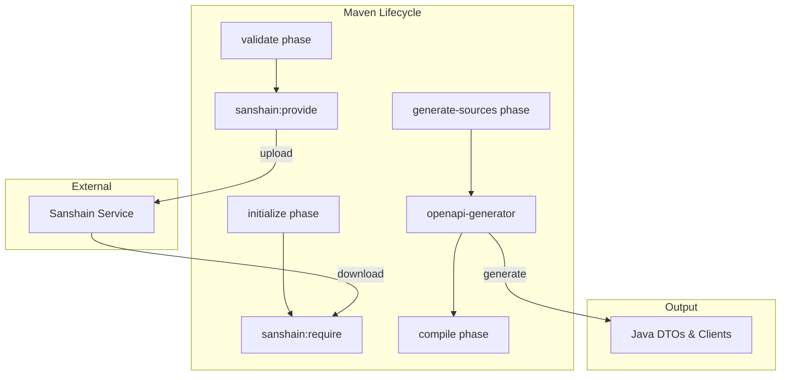

# Maven Lifecycle Integration

The Sanshain Maven Plugin is designed to seamlessly integrate into the standard Maven build lifecycle. It ensures that API contracts are validated and downloaded before code generation and compilation occur.

## Execution Flow

The following diagram shows how the Sanshain goals interact with the Maven lifecycle and external tools:

## Goals & Phases

### `sanshain:provide`
- **Default Phase**: `validate`
- **Purpose**: Uploads the service's API specifications to the Sanshain service.
- **Why `validate`?**: It ensures that the contract is registered and validated at the very beginning of the build. If the contract is rejected (e.g., breaking change on a protected branch), the build fails as early as possible.

### `sanshain:require`
- **Default Phase**: `initialize`
- **Purpose**: Downloads specific endpoint snippets required by the service.
- **Why `initialize`?**: It ensures that the required snippets are downloaded and ready before the `generate-sources` phase begins. This provides a clean separation between downloading dependencies and generating code from them.

## Key Mechanisms

### Automatic Bundling
When a service requires **2 or more endpoints** from the same provider, the plugin automatically bundles them into a single `_bundle.yaml` file. This prevents the generation of duplicate DTO classes that would occur if each endpoint were processed individually.

### Long-Polling
The `require` goal uses long-polling. The plugin makes a request and waits up to the configured `timeout` for the specification to become available on the server. This is particularly useful in CI/CD pipelines where a consumer build might start slightly before the producer build has finished uploading the new contract.

### Specification Combining (Bundling)
Before uploading (`provide`), the plugin can recursively resolve local `$ref` (OpenAPI/AsyncAPI) or `import` (Protobuf) statements. This allows you to maintain modular specification files in your repository while providing a single, self-contained contract to the Sanshain service.
